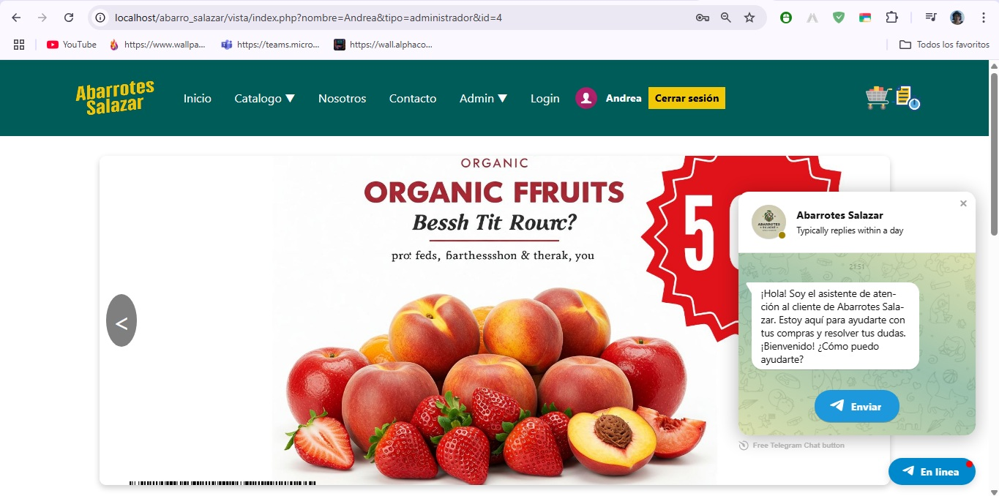
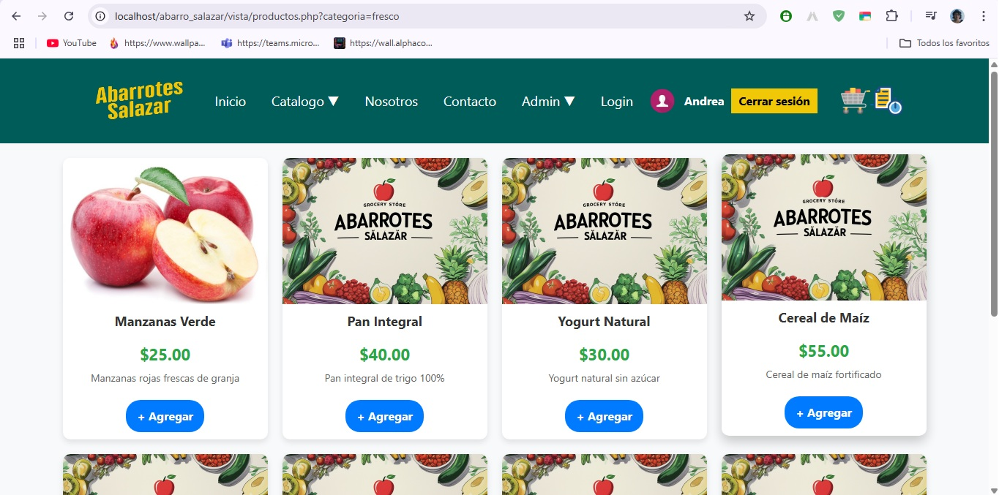
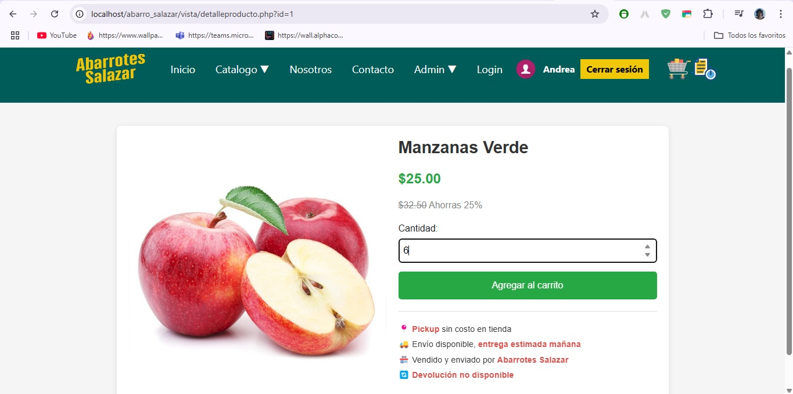
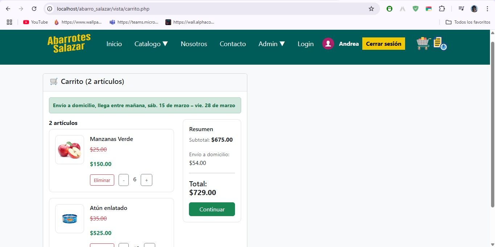
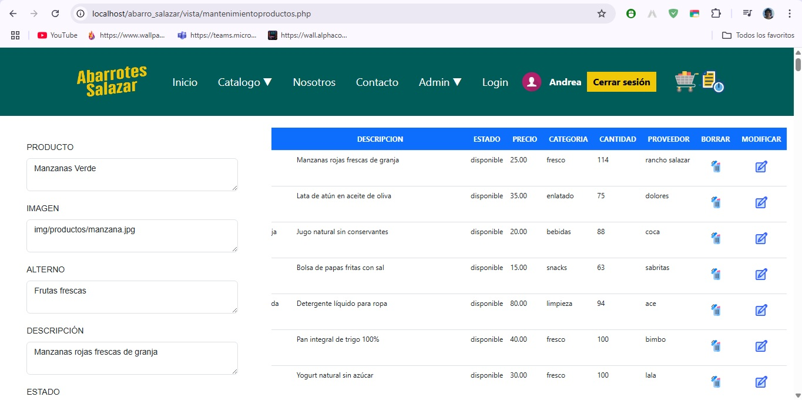
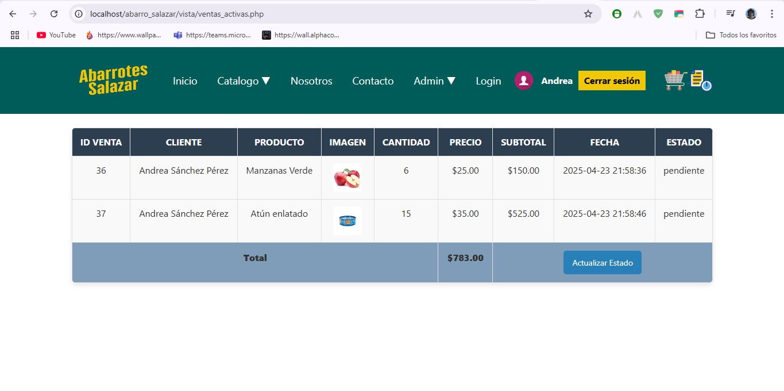
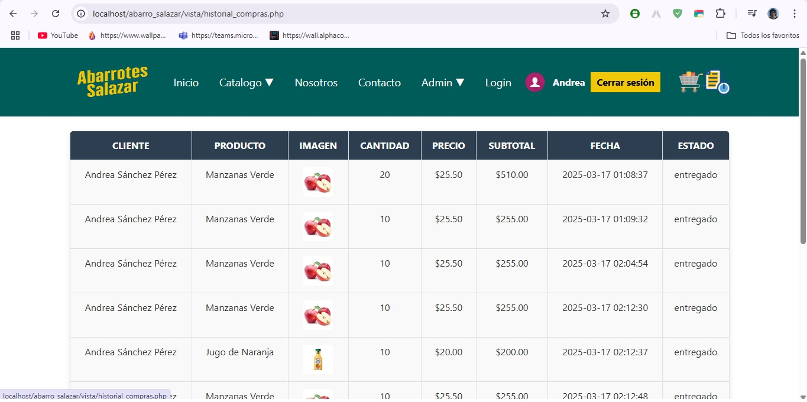

# Página WEB para la Tienda Abarrotes Salazar

## Descripción del Proyecto

"Página WEB para la Tienda Abarrotes Salazar" es una plataforma en línea desarrollada para la tienda de abarrotes del mismo nombre, con el objetivo de optimizar la gestión y administración del negocio, mejorar la interacción con los clientes y expandir su presencia en la red. Esta versión 2.0 presenta una interfaz renovada, nuevas funcionalidades y mejoras significativas en la experiencia del usuario y la administración del sistema.

## Propósito del Proyecto

Esta página web se creó para solucionar los problemas de gestión y administración de entradas y salidas de productos que enfrentaba la Tienda Abarrotes Salazar. Además, busca ofrecer un mejor control de usuarios, una visualización atractiva en línea, un registro eficiente de ventas y una plataforma interactiva y fácil de usar para los clientes.

## Características Principales (Versión 2.0)

* **Diseño y Experiencia de Usuario Mejorados:**
    * **Recoloreado General:** Se aplicó una nueva paleta de colores a todo el sistema para una apariencia más profesional y sencilla.
    * **Nuevo Logo:** Se integró un nuevo logo para la tienda, reforzando su identidad visual en línea.
    * **Interfaz del CRUD Profesional:** El panel de administración para la gestión de productos se rediseñó para ser más intuitivo y visualmente atractivo.
    * **Formulario del CRUD Optimizado:** Se simplificó el formulario de alta y edición de productos, ofreciendo opciones de selección para campos comunes y eliminando entradas manuales innecesarias.
* **Gestión de Ventas Avanzada:**
    * **Ventas Activas:** Los administradores pueden visualizar una lista de pedidos pendientes por entregar.
    * **Cambio de Estado de Venta:** Un botón permite marcar una venta activa como "completa" una vez entregada.
    * **Ventas Completas:** Se muestra un historial de todas las ventas finalizadas, organizado por cliente y con la fecha de compra.
* **Experiencia del Cliente Enriquecida:**
    * **Vista de Productos Mejorada:** Se optimizó la presentación de los productos utilizando Bootstrap para un diseño más atractivo y funcional.
    * **Botones de Carrito Claros:** Los botones para agregar productos al carrito son ahora más visibles y fáciles de usar.
    * **Carrito de Compras Integrado:** Al visualizar un producto específico, se eliminó la sección de opiniones y se añadió un carrito de compras.
    * **Gestión del Carrito:** Dentro del carrito, los usuarios pueden ajustar las cantidades de los productos (sumar o restar).
    * **Resumen de Compra Detallado:** Antes de finalizar la compra, se muestra un resumen con el total de los productos y el costo del envío.
    * **Proceso de Compra Simplificado:** Al confirmar la compra, los detalles se registran automáticamente en la sección de "Ventas Activas" para el administrador.
    * **Historial de Compras del Cliente:** Un icono junto al carrito permite a los clientes ver un registro de sus compras entregadas.
* **Gestión de Usuarios y Roles:**
    * **Catálogo para Visitantes:** Los usuarios no registrados pueden explorar los productos y ver la información básica de la tienda (Inicio, Productos, Contacto, Login).
    * **Acceso Ampliado para Clientes:** Los usuarios registrados pueden navegar por el catálogo, ver detalles de los productos y ahora tienen la capacidad de agregar productos al carrito y realizar compras. Su nombre se muestra en la barra de navegación al iniciar sesión.
    * **Administración Centralizada:** Los administradores acceden a un panel de "Mantenimiento" con funcionalidades CRUD completas para la gestión de productos. El registro de nuevos administradores se realiza ahora de forma separada (a través de otro formulario o directamente en la base de datos).

## Tecnologías Utilizadas

* **Frontend:** HTML, CSS, JavaScript, Bootstrap
* **Backend:** PHP
* **Base de Datos:** MySQL
* **Entorno de Desarrollo Local:** XAMPP

## Instalación y Ejecución (Entorno Local con XAMPP)

Esta versión 2.0 del proyecto se encuentra actualmente configurada para ejecutarse de forma local utilizando XAMPP. Para visualizar y probar la página, sigue estos pasos:

1.  **Instalar XAMPP:** Asegúrate de tener XAMPP instalado en tu sistema. Puedes descargarlo desde la página oficial de Apache Friends.
2.  **Clonar o Copiar el Proyecto:** Copia la carpeta principal del proyecto (que contiene los archivos HTML, CSS, JS, PHP y la estructura de la base de datos) dentro de la carpeta `htdocs` ubicada dentro del directorio de instalación de XAMPP. La ruta típica es `C:\xampp\htdocs\` en Windows o `/opt/lampp/htdocs/` en Linux.
3.  **Activar los Servicios de XAMPP:** Inicia los módulos de Apache y MySQL desde el panel de control de XAMPP.
4.  **Importar la Base de Datos:**
    * Abre tu navegador y ve a `http://localhost/phpmyadmin/`.
    * Crea una nueva base de datos con el nombre que utilizaste en la configuración del proyecto (por defecto, el nombre de la BD es `proyecto`).
    * Importa el archivo de la base de datos (con extensión `.sql`) que contiene la estructura y los datos iniciales de la tienda. Este archivo probablemente se encuentra dentro del proyecto: BDabarrotes_salazar.sql
5.  **Acceder a la Página Web:** Abre tu navegador y navega a la URL donde se encuentra el proyecto dentro de `htdocs`. Si la carpeta del proyecto dentro de `htdocs` se llama `abarrotes_salazar`, la URL sería `http://localhost/abarrotes_salazar_web/`. La página de inicio (generalmente `index.html` o `index.php`) debería cargarse.

## Uso

* **Visitantes:** Pueden navegar por la página principal para ver las ofertas y las categorías de productos. También pueden acceder a las páginas de "Productos" y "Contacto", así como a la página de "Login".
* **Clientes Registrados:** Después de registrarse e iniciar sesión, los clientes verán su nombre en la barra de navegación. Podrán explorar el catálogo de productos por categoría o proveedor, ver los detalles de cada producto (incluyendo el nuevo carrito de compras), agregar productos al carrito, gestionar las cantidades en el carrito y realizar compras. También podrán ver su historial de compras entregadas.
* **Administradores:** Los administradores deben ser dados de alta a través de un formulario separado o directamente en la base de datos. Al iniciar sesión, verán la opción "Mantenimiento" en la barra de navegación. Al acceder a esta sección, tendrán acceso al panel CRUD para gestionar los productos (alta, baja, modificación), así como a las secciones de "Ventas Activas" (para gestionar los pedidos pendientes) y "Ventas Completas" (para ver el historial de ventas).

## Capturas de Pantalla

*Página de inicio mostrando el carrusel de ofertas, el nuevo logo y las categorías principales de productos.*

*Vista del catálogo de productos organizados por categorías, con un diseño mejorado y botones de agregar al carrito.*

*Página de detalles de un producto específico, mostrando la información y el nuevo carrito de compras para gestionar cantidades.*

*Vista del carrito de compras donde el usuario puede ajustar cantidades y ver el resumen del pedido con el costo de envío.*

*Interfaz rediseñada del panel de administración para la gestión de productos, mostrando un diseño más profesional y eficiente.*

*Sección del panel de administración que muestra las ventas pendientes por entregar, con la opción de marcarlas como completas.*

*Vista del historial de compras entregadas para los clientes registrados.*

## Información Adicional

Este proyecto es un desarrollo académico realizado para abordar las necesidades específicas de la Tienda Abarrotes Salazar. Durante su desarrollo, actué como desarrollador full-stack, liderando la planificación e implementación de todas las funcionalidades. Actualmente, la aplicación se encuentra en un entorno local para pruebas y desarrollo. Se espera su futura implementación en un entorno de hosting para hacerlo accesible en línea.
Echa un vistazo a este video donde muestro el funcionamiento de la nueva versión de la página web de Abarrotes Salazar: [https://www.youtube.com/watch?v=abcdef12345](https://youtu.be/y-COSpHfArA?si=RmjmNUxU33EUMmbv)
